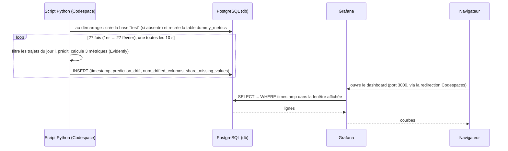
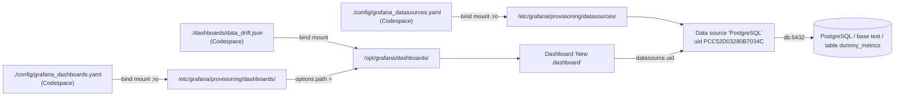

# MLOps Zoomcamp — Chapitre 5 : Monitoring d'un modèle ML

> Cours d'accompagnement du dossier `05-monitoring` de ton fork (`Janua29/mlops-zoomcamp`).
> Prérequis : Python, pandas, scikit-learn, notions de base de Docker (chapitre 4).
> Environnement : **GitHub Codespaces**. Tout (Python, Docker, conteneurs) tourne dans la VM du Codespace ; ton Mac n'exécute que le navigateur (ou VS Code).
> Les schémas ` ```mermaid ` s'affichent sur GitHub, dans Obsidian, ou dans VS Code avec l'extension *Markdown Preview Mermaid Support*.
> Envie de manipuler tout de suite ? Fais le §6 (pas à pas), puis reviens lire : c'est plus parlant avec les services qui tournent.

---

## 0. Avant de commencer : deux versions du code

Ton dossier contient **deux copies** du projet :

| Dossier | Version d'Evidently | Correspond aux vidéos ? |
|---|---|---|
| `05-monitoring/` (racine) | `evidently==0.6.7` (ancienne API) | **Oui** |
| `05-monitoring/post-evidently-0.7/` | dernière version (nouvelle API) | Non, adaptation |

Evidently a complètement changé son API en version 0.7. **Les fichiers de configuration (Docker, Grafana) et le dashboard sont identiques dans les deux dossiers.** Diffèrent : `requirements.txt`, les notebooks, les scripts Python et le README.

Attention : l'adaptation 0.7 ne calcule pas exactement la même 3ᵉ métrique. Elle mesure les valeurs manquantes de la seule colonne `prediction` (donc toujours 0, puisque la prédiction est calculée après `fillna(0)`), au lieu de l'ensemble des colonnes.

**Recommandation** : suis la racine (`05-monitoring/`) pour coller aux vidéos. Regarde `post-evidently-0.7/` ensuite pour voir l'API actuelle.

### Correspondance vidéos ↔ fichiers

| Vidéo | Sujet | Fichiers concernés |
|---|---|---|
| 5.1 | Pourquoi monitorer | — |
| 5.2 | Environnement | `requirements.txt`, `docker-compose.yml`, `config/grafana_datasources.yaml` |
| 5.3 | Modèle + données de référence | `baseline_model_nyc_taxi_data.ipynb` |
| 5.4 | Calcul des métriques Evidently | même notebook (section *Evidently Report*) |
| 5.5 | Dashboard Evidently (UI d'Evidently) | même notebook (section *Evidently Dashboard*) |
| 5.6 | Monitoring « factice » | `dummy_metrics_calculation.py` |
| 5.7 | Monitoring qualité des données | `evidently_metrics_calculation.py` |
| 5.8 | Sauvegarder le dashboard Grafana | `config/grafana_dashboards.yaml`, `dashboards/data_drift.json` |
| 5.9 | Débogage | `debugging_nyc_taxi_data.ipynb` |

---

## 1. Vue d'ensemble du projet

### 1.1 Le problème

Un modèle déployé **se dégrade sans bruit** : aucune erreur n'apparaît, les prédictions deviennent juste moins bonnes. Trois causes typiques :

- **Data drift** : la distribution des entrées change (nouveaux quartiers, nouvelles habitudes).
- **Concept drift** : la relation entrée → cible change (même distance, mais trafic différent).
- **Problèmes de qualité** : colonnes vides, valeurs aberrantes, bug dans un pipeline amont.

Difficulté centrale : en production, on n'a souvent **pas la vraie valeur (le label) tout de suite**, donc pas l'erreur du modèle en continu. On surveille des **indicateurs indirects** : si les entrées ou les prédictions s'écartent beaucoup de la période d'entraînement, c'est un signal d'alerte.

### 1.2 Le cas d'usage

- **Données** : trajets des taxis verts de New York (NYC Green Taxi), 2022.
- **Modèle** : régression linéaire qui prédit la durée d'un trajet (`duration_min`) à partir de 6 variables : `passenger_count`, `trip_distance`, `fare_amount`, `total_amount`, `PULocationID`, `DOLocationID` (zones de départ et d'arrivée). Les deux zones sont déclarées *catégorielles* pour Evidently, mais le modèle les reçoit comme de simples nombres (sans encodage) : une faiblesse assumée du modèle de démo.
- **Janvier 2022** : entraînement du modèle et **données de référence** (ce qui est « normal »).
- **Février 2022** : rejoué comme si c'était la production, **jour par jour**.

C'est du **monitoring batch** : on traite un lot (une journée) à la fois, par opposition au monitoring *online* (requête par requête). Pour la démo, un jour est rejoué **toutes les 10 secondes**.

### 1.3 Les 3 métriques calculées pour chaque jour

| Métrique | Ce qu'elle mesure | Calculée par |
|---|---|---|
| `prediction_drift` | Score d'écart entre la distribution des prédictions du jour et celle de la référence. Ici : **plus c'est haut, plus ça dérive** (seuil de dérive : 0,1) | `ColumnDriftMetric(column_name='prediction')` |
| `num_drifted_columns` | Nombre de colonnes qui ont dérivé, de 0 à 7 (les 6 variables + `prediction`) | `DatasetDriftMetric()` |
| `share_missing_values` | Part des cellules vides du jour, **sur toutes les colonnes** du fichier (pas seulement les 6 variables) | `DatasetMissingValuesMetric()` |

Deux choses à savoir pour lire les courbes :

- `share_missing_values` ne descend jamais à 0 : la colonne `ehail_fee` des données NYC est toujours vide, ce qui donne un plancher d'environ 0,05.
- Les zones `PULocationID`/`DOLocationID` ont des centaines de valeurs possibles pour ~2 000 trajets par jour : elles peuvent être signalées « en dérive » même sans vrai changement. Ne pas sur-interpréter `num_drifted_columns`.

### 1.4 Le pipeline en une phrase

**Jupyter** entraîne le modèle → un **script Python** calcule chaque jour les métriques avec **Evidently** → il les écrit dans **PostgreSQL** → **Grafana** lit PostgreSQL et affiche les courbes.

### 1.5 Structure du dossier

```
05-monitoring/
├── requirements.txt                    # paquets Python à installer dans l'env conda
├── docker-compose.yml                  # définit les 3 services (db, adminer, grafana)
├── config/
│   ├── grafana_datasources.yaml        # dit à Grafana : « voici la base à interroger »
│   └── grafana_dashboards.yaml         # dit à Grafana : « charge les dashboards de ce dossier »
├── dashboards/
│   └── data_drift.json                 # le dashboard Grafana lui-même (export JSON)
├── data/                               # vide au départ ; rempli par le notebook
├── models/                             # vide au départ ; rempli par le notebook
├── baseline_model_nyc_taxi_data.ipynb  # télécharge les données, entraîne, crée la référence
├── dummy_metrics_calculation.py        # envoie des valeurs aléatoires (test de la chaîne)
├── evidently_metrics_calculation.py    # envoie les vraies métriques Evidently
├── debugging_nyc_taxi_data.ipynb       # analyse d'un jour problématique
└── post-evidently-0.7/                 # même projet, API Evidently ≥ 0.7
```

`data_drift.json` n'est **pas** un résultat de calcul. C'est la **définition du dashboard** (quels graphiques, quelles requêtes SQL), exportée depuis Grafana en vidéo 5.8 pour ne pas la perdre. Voir §5.5.

---

## 2. Les outils

### 2.1 Rappel Docker et notion de port

Un **port** est un numéro qui désigne un programme sur une machine. `localhost:3000` signifie « le programme qui écoute sur le port 3000 de ma machine ». Par convention, PostgreSQL écoute sur 5432, Grafana sur 3000.

| Terme | Définition | Analogie |
|---|---|---|
| **Image** | Modèle figé d'un logiciel + tout ce qu'il lui faut (`postgres`, `grafana/grafana-enterprise`) | La recette |
| **Conteneur** | Une instance en cours d'exécution d'une image, isolée du reste | Le plat cuisiné |
| **Publier un port** (*port mapping*) `HÔTE:CONTENEUR` | Relier un port de la machine hôte (ici : la VM Codespace) à un port du conteneur | Une porte percée dans le mur du conteneur |

Deux points clés :

- Un conteneur se comporte comme un **mini-ordinateur séparé**, avec son propre `localhost`.
- Un conteneur est **jetable** : si on le supprime, ce qui a été écrit à l'intérieur disparaît. D'où les **volumes** (§2.3).

### 2.2 Docker Compose

Sans Compose, il faudrait lancer 3 `docker run` avec une longue liste d'options et créer les réseaux à la main. **Compose décrit toute l'infrastructure dans un seul fichier YAML** (`docker-compose.yml`, montré en entier au §5.2) et la pilote en une commande.

Le fichier décrit 4 types d'objets :

| Objet | Rôle |
|---|---|
| `services` | Les conteneurs à lancer (ici : `db`, `adminer`, `grafana`) |
| `networks` | Les réseaux virtuels qui relient les conteneurs |
| `volumes` | Les espaces de stockage qui survivent aux conteneurs |
| `ports` (dans un service) | Les ports publiés, donc ce qui est accessible depuis la machine hôte |

Le superpouvoir de Compose : **dans un même réseau, chaque service est joignable par son nom**. Docker fournit un annuaire interne (un *DNS*) qui traduit un nom de service (`db`) en adresse du conteneur. Grafana peut donc écrire `db:5432` pour joindre PostgreSQL.

Commandes essentielles (à lancer dans le dossier qui contient `docker-compose.yml`) :

| Commande | Effet |
|---|---|
| `docker compose up` | Crée réseaux + conteneurs et les démarre ; les logs s'affichent dans le terminal (Ctrl+C pour arrêter) |
| `docker compose up -d` | Pareil, mais en arrière-plan (*detached*) |
| `docker compose ps` | État des services |
| `docker compose logs -f grafana` | Suivre les logs d'un service (premier réflexe quand quelque chose ne marche pas) |
| `docker compose stop` | Arrête les conteneurs **sans les supprimer** (on les relance avec `start`, données intactes) |
| `docker compose down` | Arrête **et supprime** conteneurs et réseaux (les volumes sont conservés sur le disque) |
| `docker compose down -v` | Idem **+ supprime les volumes** (remise à zéro complète) |

> `docker-compose` (avec tiret) est l'ancienne commande (Compose v1). `docker compose` (avec espace) est la version actuelle. Les deux sont en général déjà installées dans un Codespace : rien à installer. Le README utilise l'ancienne ; les deux marchent.

### 2.3 Les volumes

**Problème** : le conteneur est éphémère, mais on veut (a) garder des données et (b) injecter des fichiers de l'hôte dans le conteneur.

Trois types de montage :

| Type | Syntaxe dans Compose | Où sont les données | Usage |
|---|---|---|---|
| **Bind mount** | `./config/x.yaml:/etc/…/x.yaml` (commence par `./` ou `/`) | Un fichier/dossier **de l'hôte** (ton Codespace), visible dans le conteneur | Injecter de la config, partager du code |
| **Volume nommé** | `grafana_data:/var/lib/grafana` + déclaration en haut du fichier | Zone gérée par Docker, repérée par son nom | Persister les données d'une base, d'une appli |
| **Volume anonyme** | Rien à écrire : créé automatiquement quand l'image le prévoit | Zone gérée par Docker, sans nom | Subi plutôt que choisi |

Syntaxe générale : `SOURCE:CIBLE[:OPTIONS]`. L'option `:ro` (*read-only*) empêche le conteneur de modifier le fichier.

Un bind mount est **un lien, pas une copie** : si tu modifies `dashboards/data_drift.json` dans ton Codespace, le conteneur voit immédiatement la nouvelle version.

**Dans ce projet** :

- **Grafana** reçoit 3 bind mounts (sa configuration et le dashboard).
- **`db`** reçoit un volume anonyme, car l'image `postgres` en prévoit un. Après un `docker compose down` puis `up`, le nouveau conteneur reçoit un **nouveau** volume vide ; l'ancien reste orphelin sur le disque (seul `down -v` le supprime). Sans importance ici : les scripts recréent la table à chaque exécution.
- **`grafana_data`** : un volume nommé déclaré, mais **utilisé par aucun service** (sans doute un oubli du fichier d'origine ; laisse-le tel quel pour suivre les vidéos). Conséquence : ce que tu crées dans l'interface Grafana (dashboards, mot de passe changé) **disparaît après un `docker compose down`**. C'est précisément pourquoi la vidéo 5.8 exporte le dashboard en JSON dans `dashboards/`.

### 2.4 PostgreSQL (service `db`)

Base de données relationnelle (SQL). Elle sert ici à **stocker l'historique des métriques** : une table avec une ligne par jour (horodatage + 3 métriques). Grafana ne calcule rien et ne stocke pas ces données : il les **lit** dans PostgreSQL.

La table s'appelle `dummy_metrics` même quand elle reçoit les vraies métriques : le nom est hérité du script de test. Les deux scripts la suppriment et la recréent au démarrage, avec des colonnes différentes. Lancer l'un efface donc les données de l'autre.

### 2.5 Adminer (service `adminer`)

Interface web minimaliste pour **explorer une base de données** (voir les tables, lancer du SQL). Utile pour vérifier que le script écrit bien. Aucun rôle dans le pipeline lui-même.

### 2.6 Grafana (service `grafana`)

Outil de **visualisation de séries temporelles**. Vocabulaire :

| Terme | Définition |
|---|---|
| **Data source** | Une connexion vers une source de données (ici : PostgreSQL) |
| **Dashboard** | Une page qui regroupe des graphiques |
| **Panel** | Un graphique, alimenté par une requête (ici : SQL) |
| **Time range** | La fenêtre de temps affichée (en haut à droite) ; injectée dans les requêtes |
| **Provisioning** | Configurer Grafana par **fichiers** au démarrage, au lieu de cliquer dans l'interface |

Le provisioning est le concept clé du chapitre. `grafana_datasources.yaml` et `grafana_dashboards.yaml` sont des fichiers de provisioning : après `docker compose up`, Grafana est **déjà configuré**, de façon reproductible (*configuration as code*).

Grafana peut aussi déclencher des **alertes** (ex. notification si `prediction_drift` > 0,1) : c'est l'étape naturelle suivante, non traitée dans le chapitre.

### 2.7 Evidently

Librairie Python spécialisée dans l'évaluation et le monitoring de modèles ML.

| Objet (API 0.6.x) | Rôle |
|---|---|
| `ColumnMapping` | Décrit les colonnes : lesquelles sont numériques, catégorielles, la prédiction, la cible |
| `Report` | Calcule une liste de métriques, restituées en HTML (`show()`) ou en dictionnaire Python (`as_dict()`) |
| `TestSuite` | Comme un Report, mais chaque élément renvoie **réussi/échoué** selon un seuil (vidéo 5.9) |
| `Workspace` + commande `evidently ui` | L'interface de dashboards propre à Evidently (vidéo 5.5), sur `http://localhost:8000` |

Deux solutions de dashboard coexistent donc : **l'UI d'Evidently** (5.5, rapide à mettre en place) et **Grafana** (5.6 et suivantes, générique, standard en entreprise). La suite du chapitre utilise Grafana.

### 2.8 Prefect (optionnel)

Orchestrateur de workflows vu au chapitre 3. Dans `evidently_metrics_calculation.py`, les décorateurs `@flow` et `@task` permettent de suivre l'exécution dans l'interface de Prefect. **Le README précise que Prefect n'est pas officiellement couvert depuis l'édition 2024** : tu peux sauter ce passage de la vidéo 5.7 (07:33–11:21). Le script fonctionne sans que tu lances quoi que ce soit : Prefect démarre de lui-même un serveur temporaire en local et l'arrête à la fin.

---

## 3. Les paquets Python (`requirements.txt`)

Ces paquets s'installent **dans le Codespace**, dans l'environnement conda `mlopszoomcamp`, pas dans les conteneurs Docker.

| Paquet | À quoi il sert | Où il est utilisé |
|---|---|---|
| `evidently==0.6.7` | Calcul des métriques de drift et de qualité. Version **figée** car l'API a changé en 0.7 | Notebooks, `evidently_metrics_calculation.py` |
| `psycopg` | Pilote PostgreSQL (version 3) : permet à Python de se connecter à la base et d'envoyer du SQL | Les deux scripts `*_metrics_calculation.py` |
| `psycopg_binary` | Partie compilée de psycopg, livrée toute prête : évite d'installer les outils PostgreSQL dans le Codespace | Utilisé automatiquement par `psycopg` |
| `prefect` | Orchestration (§2.8) | `evidently_metrics_calculation.py` |
| `requests` | Requêtes HTTP : télécharge les fichiers de données | Notebook baseline |
| `tqdm` | Barre de progression | Téléchargement dans le notebook baseline |
| `pyarrow` | Moteur de lecture/écriture du format **Parquet** (format de fichier en colonnes, compressé) ; pandas s'en sert dans `read_parquet` / `to_parquet` | Partout où on lit les données |
| `joblib` | Sauvegarde/chargement d'objets Python, notamment du modèle scikit-learn → `models/lin_reg.bin` | Notebooks, script Evidently |

`jupyter` (dans la liste) fournit le moteur des notebooks ; dans Codespaces, on ouvre simplement le `.ipynb` dans VS Code (§6). Les scripts importent aussi `pytz` (fuseaux horaires) : absent de la liste, il est installé automatiquement avec Prefect.

---

## 4. L'architecture

### 4.1 Qui tourne où

Trois lieux :

- **Ton Mac** : seulement le navigateur (ou VS Code en local). Rien du projet n'y tourne.
- **La VM Codespace (l'hôte)** : une machine Linux chez GitHub. Elle exécute l'environnement conda `mlopszoomcamp`, Jupyter, les scripts et Docker.
- **Docker, dans la VM** : les 3 conteneurs.

Le lien entre ton Mac et la VM est la **redirection de ports de Codespaces**. Quand un programme écoute sur un port de la VM (3000, 8080…), Codespaces le rend accessible à ton navigateur. L'onglet **Ports** de VS Code liste ces redirections et leur adresse :

- dans le navigateur : `https://<nom-du-codespace>-3000.app.github.dev` ;
- avec VS Code installé en local : `http://localhost:3000`, car VS Code relaie le port jusqu'à ton Mac.

Par défaut, ces ports sont **privés** : seul toi, connecté à ton compte GitHub, peux les ouvrir.

Comme chaque conteneur a son propre `localhost` (§2.1), le mot ne désigne pas la même chose selon l'endroit d'où l'on parle :

| Vu depuis… | `localhost` = | Pour joindre PostgreSQL, on écrit | Dans le code |
|---|---|---|---|
| La VM Codespace (script Python) | La VM Codespace | `localhost:5432`, qui passe par le port publié | `psycopg.connect("host=localhost port=5432 dbname=test user=postgres password=example")` |
| Le conteneur Grafana | **Le conteneur Grafana lui-même** | `db:5432`, via le DNS de Docker | `url: db:5432` dans `grafana_datasources.yaml` |

C'est la notion la plus importante de l'architecture : le script dit `localhost`, Grafana dit `db`, et **les deux ont raison**.

> **Point à vérifier chez toi** : selon la configuration du Codespace, Docker peut tourner dans ton environnement ou juste à côté. Dans le second cas, `localhost:5432` pourrait ne pas atteindre PostgreSQL depuis le terminal. C'est rare pour ce cours, mais vérifie : après `docker compose up -d`, `python dummy_metrics_calculation.py` doit afficher « data sent ».

### 4.2 Schéma

```
┌───────────────────────────────────── TON MAC ────────────────────────────────────┐
│  Navigateur (ou VS Code installé en local)                                       │
│    Grafana : https://<nom-du-codespace>-3000.app.github.dev                      │
│    Adminer : https://<nom-du-codespace>-8080.app.github.dev                      │
│    (avec VS Code local : http://localhost:3000 et http://localhost:8080)         │
└────────────────────────────────────────────────────────┬───────────┬─────────────┘
                      HTTPS, via la redirection de ports │           │
                      de Codespaces (onglet « Ports »)   │           │
┌───────────────────────────── VM CODESPACE (hôte) ──────┼───────────┼─────────────┐
│                                                        │           │             │
│  env conda mlopszoomcamp                               │           │             │
│  ┌──────────────────────────────┐                      │           │             │
│  │ Jupyter : notebook baseline  │                      │           │             │
│  │ evidently_metrics_           │                      │           │             │
│  │   calculation.py             │                      │           │             │
│  └──────────────┬───────────────┘                      │           │             │
│                 │ SQL INSERT                           │           │             │
│                 │ vers localhost:5432                  │           │             │
│ ════════════════╪══════ ports publiés (VM → Docker) ═══╪═══════════╪════════════ │
│ ┌───────────────┼──────────────────── DOCKER ──────────┼───────────┼──────────┐  │
│ │               │ 5432                            3000 │      8080 │          │  │
│ │               │                            ┌─────────▼──┐  ┌─────▼─────┐    │  │
│ │               │         bind mounts ──────►│  grafana   │  │  adminer  │    │  │
│ │               │         (config/,          │   :3000    │  │   :8080   │    │  │
│ │               │          dashboards/)      └─────────┬──┘  └─────┬─────┘    │  │
│ │               │                    par le nom « db » │           │          │  │
│ │               │                    (réseau back-tier)│           │          │  │
│ │               ▼                                      ▼           ▼          │  │
│ │  ┌──────────────────────────────────────────────────────────────────────┐   │  │
│ │  │                     db  —  PostgreSQL  :5432                         │   │  │
│ │  └──────────────────────────────────────────────────────────────────────┘   │  │
│ │  db est sur back-tier ; grafana et adminer sont sur back-tier ET front-tier │  │
│ └─────────────────────────────────────────────────────────────────────────────┘  │
└──────────────────────────────────────────────────────────────────────────────────┘
```

Lecture, de haut en bas :

1. Ton navigateur atteint la VM par la **redirection de ports de Codespaces** (HTTPS sur Internet).
2. Dans la VM, les flèches qui **traversent la ligne ═══** passent par un **port publié** (VM → conteneur).
3. Celles qui restent **dans le cadre DOCKER** passent par le réseau interne et le nom `db`.

### 4.3 Table des flux

| # | De | Vers | Adresse utilisée | Protocole | Quand |
|---|---|---|---|---|---|
| 1 | Notebook (Codespace) | Serveur de données NYC (Internet) | `https://d37ci6vzurychx.cloudfront.net/…` | HTTPS | Une fois (téléchargement) |
| 2 | Script Python (Codespace) | `db` | `localhost:5432` | PostgreSQL | Toutes les 10 s (INSERT) |
| 3 | Navigateur (Mac) | `grafana` | `https://<codespace>-3000.app.github.dev` (ou `http://localhost:3000` via VS Code local), puis port publié 3000 | HTTPS → HTTP | Quand tu consultes |
| 4 | `grafana` | `db` | `db:5432` (réseau `back-tier`) | PostgreSQL | À chaque rafraîchissement d'un panel (SELECT) |
| 5 | Navigateur (Mac) | `adminer` | `https://<codespace>-8080.app.github.dev` (ou `http://localhost:8080` via VS Code local), puis port publié 8080 | HTTPS → HTTP | Quand tu consultes |
| 6 | `adminer` | `db` | `db:5432` (réseau `back-tier`) | PostgreSQL | Quand tu navigues dans Adminer |
| 7 | `grafana` | Fichiers du Codespace | Bind mounts | Système de fichiers | Data source : au démarrage. Dashboards : au démarrage puis en continu |
| 8 | Script Python (Codespace) | Serveur Prefect temporaire (Codespace) | `127.0.0.1:<port aléatoire>` | HTTP | Pendant l'exécution du script Evidently |
| 9 | Navigateur (Mac) | UI Evidently (vidéo 5.5 seulement) | Port 8000 redirigé par Codespaces (même logique que 3000) | HTTPS → HTTP | Si tu lances `evidently ui` |

Sens des flux : c'est toujours **le client qui ouvre** la connexion. PostgreSQL ne « pousse » jamais rien : le script écrit, Grafana vient lire (modèle *pull*).

### 4.4 Déroulé d'un cycle de monitoring



### 4.5 Les réseaux `front-tier` et `back-tier`

L'intention est un découpage classique en deux zones : **back-tier** (l'arrière-boutique, où se trouve la base) et **front-tier** (la vitrine, les services destinés aux utilisateurs). `db` n'est que sur `back-tier` ; `grafana` et `adminer` sont sur les deux.

Dans ce projet, le découpage **n'a pas d'effet concret** : aucun service n'est seul sur `front-tier`, et le port 5432 est de toute façon publié sur la VM Codespace (indispensable pour le script Python). C'est un modèle d'organisation à connaître, qui prendrait son sens avec, par exemple, une API publique placée uniquement sur `front-tier` et une base non publiée.

Approfondissement : voir `cours-05-reseaux-docker.md` (même dossier).

---

## 5. Les fichiers de configuration, ligne par ligne

### 5.1 `requirements.txt`

Une ligne = un paquet (voir §3).

- `nom` seul → pip installe la **dernière version** compatible.
- `nom==x.y.z` → version **exacte** (ici seulement `evidently==0.6.7`).

```bash
conda activate mlopszoomcamp                       # active l'environnement conda du cours
pip install -r requirements.txt                    # -r = lire la liste dans ce fichier
pip install "pandas<3"                             # voir ci-dessous
```

Seul Evidently étant figé, les autres paquets prennent leur dernière version le jour de l'installation. Pratique, mais pas reproductible : si un jour quelque chose casse, c'est la première piste (voir §7).

**Cas connu : pandas 3.** Sans version imposée, pip installe aujourd'hui pandas 3. La cellule 34 du notebook baseline plante alors avec `ValueError: Invalid frequency: H`. D'où la 3ᵉ commande ci-dessus, qui installe la dernière version 2.x.

### 5.2 `docker-compose.yml`

Le fichier complet :

```yaml
version: '3.7'

volumes:
  grafana_data: {}

networks:
  front-tier:
  back-tier:

services:
  db:
    image: postgres
    restart: always
    environment:
      POSTGRES_PASSWORD: example
    ports:
      - "5432:5432"
    networks:
      - back-tier

  adminer:
    image: adminer
    restart: always
    ports:
      - "8080:8080"
    networks:
      - back-tier
      - front-tier

  grafana:
    image: grafana/grafana-enterprise
    user: "472"
    ports:
      - "3000:3000"
    volumes:
      - ./config/grafana_datasources.yaml:/etc/grafana/provisioning/datasources/datasource.yaml:ro
      - ./config/grafana_dashboards.yaml:/etc/grafana/provisioning/dashboards/dashboards.yaml:ro
      - ./dashboards:/opt/grafana/dashboards
    networks:
      - back-tier
      - front-tier
    restart: always
```

Rappel YAML : l'**indentation** définit la hiérarchie (ce qui est décalé sous `db:` appartient à `db`) ; un `-` introduit un élément de liste.

Bloc par bloc :

```yaml
version: '3.7'
```
Version du format de fichier. **Obsolète** avec Compose v2 : ignorée, avec un avertissement (`the attribute version is obsolete`). Sans conséquence.

```yaml
volumes:
  grafana_data: {}
```
Déclare un volume nommé `grafana_data`, configuration par défaut (`{}`). **Aucun service ne le monte** (§2.3). Pour persister Grafana, il faudrait ajouter `- grafana_data:/var/lib/grafana` dans les `volumes` du service `grafana`.

> **D'où vient `/var/lib/grafana` ?** Ni du formateur ni du projet : c'est **la valeur par défaut de l'image Docker officielle de Grafana**. Son Dockerfile définit la variable `GF_PATHS_DATA=/var/lib/grafana`. Grafana y range sa base interne, le fichier `grafana.db` : utilisateurs, dashboards créés dans l'interface, etc.
> **Bonne pratique** : pour toute image, lis sa documentation sur Docker Hub (ici `hub.docker.com/r/grafana/grafana-enterprise`, qui renvoie vers la page Grafana *Run Grafana Docker image*). Elle indique où l'image range ses données, quelles variables d'environnement elle lit et sur quel port elle écoute. PostgreSQL fonctionne pareil, avec sa variable `PGDATA`.
> Pour vérifier toi-même, services lancés :
> ```bash
> docker compose exec grafana env | grep GF_PATHS   # GF_PATHS_DATA=/var/lib/grafana
> docker compose exec grafana ls /var/lib/grafana   # grafana.db, plugins/…
> docker image inspect grafana/grafana-enterprise   # section "Env" : les variables définies par l'image
> ```

```yaml
networks:
  front-tier:
  back-tier:
```
Déclare deux réseaux avec les réglages par défaut : des réseaux privés virtuels entre conteneurs (type *bridge*). Compose les nomme réellement `<nom-du-projet>_front-tier`, le nom du projet étant par défaut celui du dossier.

```yaml
services:
  db:
    image: postgres
```
Service `db` (ce nom devient son nom DNS sur les réseaux), basé sur l'image officielle PostgreSQL. Sans tag de version (`postgres:17`, etc.), Docker prend `latest` : la version la plus récente au moment du premier téléchargement.

```yaml
    restart: always
```
Si le conteneur s'arrête (plantage), Docker le relance ; il redémarre aussi quand Docker redémarre (par exemple au réveil du Codespace).

```yaml
    environment:
      POSTGRES_PASSWORD: example
```
Variable d'environnement lue par l'image au premier démarrage : mot de passe de l'administrateur de la base, l'utilisateur `postgres`. Obligatoire pour cette image (sauf configuration particulière). En clair : acceptable en local, jamais en production.

```yaml
    ports:
      - "5432:5432"
    networks:
      - back-tier
```
Publie le port : 5432 de la VM Codespace → 5432 du conteneur. C'est ce qui permet au script Python d'écrire via `localhost:5432`. `db` n'est que dans `back-tier`.

```yaml
  adminer:
    image: adminer
    restart: always
    ports:
      - "8080:8080"
    networks:
      - back-tier
      - front-tier
```
Même logique. Adminer écoute sur 8080, publié sur 8080 de la VM Codespace. Il est sur `back-tier` **pour pouvoir joindre `db`**.
Pour se connecter dans Adminer : Système `PostgreSQL`, Serveur **`db`** (pas `localhost` : c'est le conteneur Adminer qui se connecte), Utilisateur `postgres`, Mot de passe `example`, Base `test`.

```yaml
  grafana:
    image: grafana/grafana-enterprise
```
Édition *Enterprise* de Grafana ; sans licence, elle fonctionne comme la version gratuite. Sans tag → dernière version.

```yaml
    user: "472"
```
Numéro d'utilisateur Linux (UID) sous lequel Grafana tourne dans le conteneur. 472 est l'utilisateur `grafana` de l'image, donc déjà la valeur par défaut ; la ligne le rend explicite. Ça compte pour les **droits sur les fichiers montés** : cet utilisateur doit pouvoir les lire.

```yaml
    ports:
      - "3000:3000"
```
Interface web de Grafana, publiée sur le port 3000 de la VM, puis redirigée vers ton navigateur par Codespaces (§4.1).

```yaml
    volumes:
      - ./config/grafana_datasources.yaml:/etc/grafana/provisioning/datasources/datasource.yaml:ro
```
Bind mount **d'un fichier**, en lecture seule. Au démarrage, Grafana lit tous les fichiers YAML de son dossier de provisioning des sources, `/etc/grafana/provisioning/datasources/` (chemin par défaut de Grafana). Le nom du fichier (`datasource.yaml`) est libre.

```yaml
      - ./config/grafana_dashboards.yaml:/etc/grafana/provisioning/dashboards/dashboards.yaml:ro
```
Même principe pour les **fournisseurs de dashboards** (`/etc/grafana/provisioning/dashboards/`).

```yaml
      - ./dashboards:/opt/grafana/dashboards
```
Bind mount **d'un dossier** : `dashboards/` du Codespace apparaît dans le conteneur sous `/opt/grafana/dashboards`. Ce chemin est un choix du projet et **doit correspondre** à `options.path` dans `grafana_dashboards.yaml` (§5.4).

```yaml
    networks:
      - back-tier
      - front-tier
    restart: always
```
Sur `back-tier` pour interroger `db`.

> Rien n'impose de démarrer `db` avant `grafana` (clé `depends_on` absente). Ce n'est pas bloquant : Grafana ne se connecte à la base que lorsqu'un panel l'interroge.

### 5.3 `config/grafana_datasources.yaml`

Rôle : créer automatiquement la connexion Grafana → PostgreSQL.

```yaml
apiVersion: 1
```
Version du format des fichiers de provisioning Grafana (toujours `1`).

```yaml
datasources:
  - name: PostgreSQL
```
Liste des sources (on pourrait en déclarer plusieurs). `name` : nom affiché dans Grafana.
**Important** : aucun identifiant technique (`uid`) n'est fourni, donc Grafana le **calcule à partir du nom** : `PostgreSQL` → `PCC52D03280B7034C`. C'est exactement l'`uid` inscrit dans `data_drift.json`. **Si tu renommes la source, le dashboard ne la trouve plus.** Pour supprimer ce lien caché, on peut ajouter `uid: PCC52D03280B7034C` explicitement.

```yaml
    type: postgres
```
Quel connecteur (plugin) utiliser : celui de PostgreSQL, intégré à Grafana. (Son identifiant officiel actuel est `grafana-postgresql-datasource` ; `postgres` reste accepté.)

```yaml
    access: proxy
```
**Qui se connecte à la base ?** `proxy` = le serveur Grafana (dans le conteneur), pas ton navigateur. Le navigateur demande à Grafana, qui interroge la base. D'où l'URL suivante, écrite du point de vue du conteneur.

```yaml
    url: db:5432
```
`hôte:port` vu depuis le conteneur Grafana. `db` est traduit par le DNS de Docker (réseau `back-tier`). `localhost:5432` **ne fonctionnerait pas** ici : ce serait le conteneur Grafana lui-même.

```yaml
    database: test
    user: postgres
```
Base et utilisateur. La base `test` **n'existe pas au démarrage** : c'est le script Python qui la crée. Avant son premier lancement, le bouton *Save & test* de la source échoue ; c'est normal.

```yaml
    secureJsonData:
      password: 'example'
```
`secureJsonData` = champs sensibles : Grafana les **chiffre** dans sa base interne et ne les réaffiche jamais.

```yaml
    jsonData:
      sslmode: 'disable'
      database: test
```
`jsonData` = options propres au connecteur.
- `sslmode: 'disable'` : connexion non chiffrée. Le PostgreSQL du conteneur n'est pas configuré pour le chiffrement (TLS/SSL) ; sans cette ligne, selon la version de Grafana, la connexion risque d'échouer.
- `database` en double : les versions récentes de Grafana lisent la base ici, les anciennes au niveau supérieur. Les deux sont renseignés par compatibilité.

### 5.4 `config/grafana_dashboards.yaml`

Rôle : dire à Grafana **où trouver des fichiers de dashboards**. Il ne contient pas de dashboard, seulement un « fournisseur » (*provider*).

```yaml
apiVersion: 1
providers:
  - name: 'Evidently Dashboards'
```
Liste de fournisseurs. `name` : identifiant unique, libre.

```yaml
    orgId: 1
    folder: ''
    folderUid: ''
```
Réglages par défaut, à laisser tels quels. `orgId: 1` = l'organisation Grafana créée par défaut (Grafana peut héberger plusieurs organisations isolées). `folder` / `folderUid` vides = dossier racine ; ils doivent rester vides car c'est `foldersFromFilesStructure` (plus bas) qui décide des dossiers.

```yaml
    type: file
```
Les dashboards viennent de fichiers sur disque.

```yaml
    disableDeletion: false
```
Si tu supprimes le fichier JSON du disque, Grafana supprime aussi le dashboard. (`true` = il le garderait.)

```yaml
    updateIntervalSeconds: 10
```
Grafana vérifie le dossier environ toutes les 10 s : une modification du JSON dans le Codespace apparaît sans redémarrage (rafraîchis la page du navigateur).

```yaml
    allowUiUpdates: false
```
Tu peux modifier un dashboard provisionné dans l'interface, mais **pas l'enregistrer** (message *Cannot save provisioned dashboard*) : Grafana te propose d'exporter le JSON. Le fichier reste la seule source de vérité. Avec `true`, les modifications seraient enregistrées dans la base interne de Grafana, puis écrasées dès que le fichier change.

```yaml
    options:
      path: /opt/grafana/dashboards
```
Dossier à scanner, **vu depuis le conteneur**. Doit être identique à la cible du bind mount `./dashboards:/opt/grafana/dashboards`. Si les deux divergent, l'interface n'affiche aucune erreur ; l'erreur n'apparaît que dans `docker compose logs grafana`.

```yaml
      foldersFromFilesStructure: true
```
Les sous-dossiers de `dashboards/` deviennent des dossiers Grafana (`dashboards/drift/a.json` → dossier *drift*). Ici le fichier est à la racine → dossier racine.

### 5.5 `dashboards/data_drift.json`

C'est le **modèle JSON d'un dashboard Grafana** : la forme sous laquelle Grafana décrit chaque dashboard. Tu ne l'écris pas à la main, tu l'exportes depuis l'interface (vidéo 5.8) :

- *Dashboard settings → JSON Model*, ou *Share/Export → Export as JSON* (l'intitulé exact dépend de la version de Grafana).
- **Ne coche pas** *Export for sharing externally* (ou *Share with another instance*) : cette option remplace l'`uid` de la source par une variable `${DS_POSTGRESQL}` que le provisioning ne sait pas résoudre, et le dashboard afficherait *Datasource not found*.

Champs utiles :

| Champ | Valeur | Rôle |
|---|---|---|
| `title` | `"New dashboard"` | Nom affiché (celui à chercher dans Grafana) |
| `uid` | `"NPXSRpQ4z"` | Identifiant stable du dashboard (fixe son URL : `/d/NPXSRpQ4z`) |
| `panels` | 3 éléments | Les 3 graphiques |
| `panels[].type` | `"timeseries"` | Courbe en fonction du temps |
| `panels[].datasource` | `{"type": "postgres", "uid": "PCC52D03280B7034C"}` | Source interrogée ; l'`uid` doit correspondre à celui de la data source (§5.3) |
| `panels[].targets[].rawSql` | voir ci-dessous | La requête SQL du panel |
| `time` | du 22/01/2022 au 18/02/2022 | Fenêtre de temps affichée à l'ouverture |
| `schemaVersion` | `36` | Version du format ; Grafana migre automatiquement les anciens formats |

Pas de clé `refresh` : le dashboard ne se rafraîchit pas tout seul (voir §6).

La requête d'un panel :

```sql
SELECT
  "timestamp" AS "time",        -- Grafana attend une colonne de temps nommée "time"
  prediction_drift              -- la valeur à tracer
FROM dummy_metrics
WHERE
  $__timeFilter("timestamp")    -- macro Grafana → "timestamp" BETWEEN <début> AND <fin> de la fenêtre affichée
ORDER BY 1                      -- tri par la 1re colonne (le temps)
```

**Piège classique** : les métriques sont horodatées **en février 2022** (le script rejoue le passé), pas aujourd'hui. Avec une fenêtre « Last 6 hours », les graphiques sont vides. Règle la fenêtre sur **1er → 28 février 2022** (celle enregistrée s'arrête au 18 février).

`dummy_metrics_calculation.py`, lui, horodate avec l'heure actuelle : pour ses données, choisis « Last 5 minutes ».

### 5.6 La chaîne de provisioning, vue d'ensemble



Trois correspondances doivent tenir, sinon « ça ne marche pas » sans message clair dans l'interface :

1. Cible du bind mount `./dashboards` = `options.path`.
2. `uid` de la data source = `datasource.uid` des panels.
3. Base et table interrogées = celles créées par le script (`test`, `dummy_metrics`).

---

## 6. Pas à pas

```bash
# 0. Dans le dossier 05-monitoring (celui qui contient docker-compose.yml)
conda activate mlopszoomcamp
pip install -r requirements.txt
pip install "pandas<3"             # pandas 3 casse le notebook baseline (§5.1)

# 1. Services
docker compose up -d
docker compose ps                  # vérif : 3 services "running"/"Up"

# 2. Modèle et référence : ouvrir baseline_model_nyc_taxi_data.ipynb dans VS Code,
#    choisir le noyau conda (bouton "Select Kernel" en haut à droite → mlopszoomcamp),
#    puis "Run All"
#    vérif : data/green_tripdata_2022-01.parquet, data/green_tripdata_2022-02.parquet,
#            data/reference.parquet, models/lin_reg.bin existent

# 3. (vidéo 5.6) Test de la chaîne avec des valeurs aléatoires
python dummy_metrics_calculation.py        # Ctrl+C pour arrêter

# 4. (vidéo 5.7) Vraies métriques : 27 jours × 10 s ≈ 4 min 30
python evidently_metrics_calculation.py
```

Contrôles :

Les adresses ci-dessous sont celles de l'onglet **Ports** de VS Code : `https://<nom-du-codespace>-<port>.app.github.dev` dans le navigateur, ou `http://localhost:<port>` avec VS Code local.

| Étape | Où regarder | Attendu |
|---|---|---|
| Ports | Onglet **Ports** de VS Code | 3000 et 8080 listés (sinon *Forward a Port* et ajouter le numéro) |
| Base | Port 8080 (serveur `db`) | Base `test`, table `dummy_metrics` qui se remplit |
| Grafana | Port 3000, identifiants `admin` / `admin` (Grafana propose ensuite de changer le mot de passe ; on peut passer) | Menu *Dashboards* → *New dashboard* |
| Courbes | Fenêtre de temps : février 2022 ; activer le rafraîchissement automatique (menu à côté du bouton ⟳, en haut à droite : 5s ou 10s) | 3 courbes qui gagnent un point toutes les 10 s |

Arrêt : `docker compose down`.

---

## 7. Problèmes fréquents

| Symptôme | Cause probable | Solution |
|---|---|---|
| `port is already allocated` sur 5432 | Un autre conteneur (lancement précédent, autre chapitre) utilise déjà le port | `docker ps` pour le repérer, puis `docker compose down` dans son dossier ; ou publier `"5433:5432"` et mettre `port=5433` dans les scripts |
| Page Grafana/Adminer inaccessible dans le navigateur | Port non redirigé par Codespaces | Onglet **Ports** → *Forward a Port* → `3000` (ou `8080`) |
| Script : `connection refused` sur `localhost:5432` | Conteneurs non démarrés | `docker compose ps`, puis `up -d` |
| Script : `No such file 'data/reference.parquet'` | Notebook baseline non exécuté, ou script lancé depuis un autre dossier | Exécuter le notebook ; lancer le script depuis `05-monitoring/` (chemins relatifs) |
| Grafana : graphiques vides | Mauvaise fenêtre de temps | Régler sur février 2022 (§5.5) |
| Grafana : courbes figées | Pas de rafraîchissement automatique | Activer l'auto-refresh ou rafraîchir (§6) |
| Grafana : *Datasource not found* | `uid` de la source ≠ `uid` dans le JSON (source renommée, ou export « for sharing externally ») | §5.3 et §5.5 |
| Grafana : *Save & test* échoue | Base `test` pas encore créée | Lancer un script une première fois |
| Dashboard créé dans l'UI disparu | Pas de volume pour `/var/lib/grafana` | Exporter en JSON dans `dashboards/` (vidéo 5.8) |
| Grande trace rouge Prefect `Error encountered when computing cache key` | Prefect essaie de mettre la tâche en cache, mais le curseur de base de données passé en argument ne peut pas être sauvegardé | Sans gravité : le script continue et les métriques sont écrites |
| `ImportError` dans Evidently | Code 0.6 avec Evidently 0.7 (ou l'inverse) | `pip show evidently` et vérifier le dossier suivi (§0) |
| Notebook baseline, cellule 34 : `ValueError: Invalid frequency: H` | pandas 3 installé (pandas n'est pas figé dans `requirements.txt`) | `pip install "pandas<3"`, puis redémarrer le noyau du notebook |
| Erreur étrange après une nouvelle installation | Un paquet non figé a sorti une version incompatible | Figer les versions (`pip freeze > requirements.lock.txt` une fois que tout marche) |

---

## 8. Pour aller plus loin

- **Persistance** : monter `grafana_data:/var/lib/grafana` (chemin par défaut de l'image, §5.2) et un volume nommé pour PostgreSQL. Attention : les images PostgreSQL 18+ attendent le volume sur `/var/lib/postgresql`, et non plus `/var/lib/postgresql/data`. Vérifie la doc de la version utilisée.
- **Reproductibilité** : figer les versions des images (`postgres:17`, `grafana/grafana-enterprise:<version>`) et des paquets Python.
- **Secrets** : mettre le mot de passe dans un fichier `.env` non versionné et écrire `POSTGRES_PASSWORD: ${POSTGRES_PASSWORD}` (Compose remplace la variable à partir du `.env`), ou utiliser `env_file:`.
- **Exposition réseau** : dans Codespaces, les ports redirigés sont **privés** par défaut (toi seul, authentifié sur GitHub). Ne passe pas un port en visibilité *Public* dans l'onglet Ports : Grafana (`admin`/`admin`) ou Adminer deviendraient accessibles à n'importe qui sur Internet. Sur une machine classique, `"5432:5432"` publie le port sur toutes les interfaces réseau ; `"127.0.0.1:5432:5432"` le limite à la machine elle-même.
- **Robustesse** : `depends_on` + `healthcheck` pour démarrer Grafana une fois PostgreSQL prêt.
- **Alerting** : règle Grafana « si `prediction_drift` > 0,1 → notification ». Les délais d'une alerte se comptent en temps réel, pas en temps des données : pendant le rejeu, un « jour » dure 10 s.
- **Tests statistiques** : pour les colonnes numériques avec plus de 1 000 lignes de référence (notre cas : ~25 000), Evidently utilise par défaut la distance de Wasserstein normalisée (plus haut = plus de dérive). Avec une petite référence, il utilise un test de Kolmogorov-Smirnov dont le score est une p-value (plus **bas** = plus de dérive, seuil 0,05). Toujours vérifier la méthode avant d'interpréter un score.
- **Quand le label arrive** (ex. durée réelle connue le lendemain) : calculer l'erreur réelle (MAE) par jour. C'est la vraie métrique de performance ; le drift n'en est qu'un indicateur avancé.
